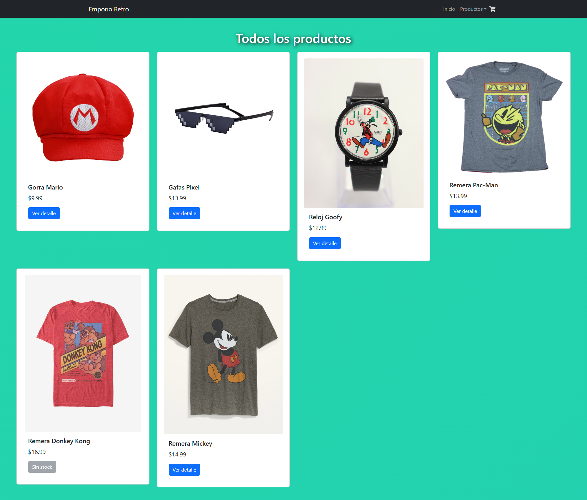
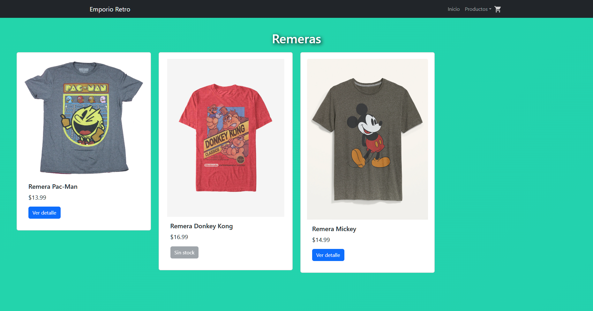
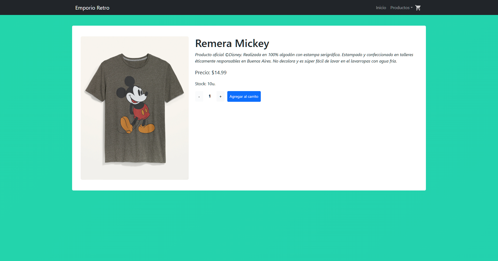
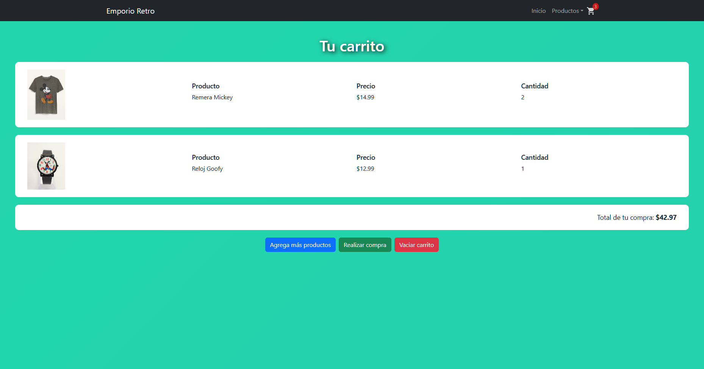
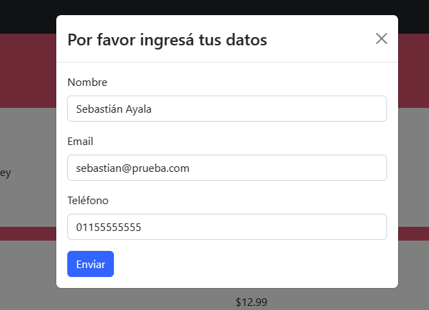
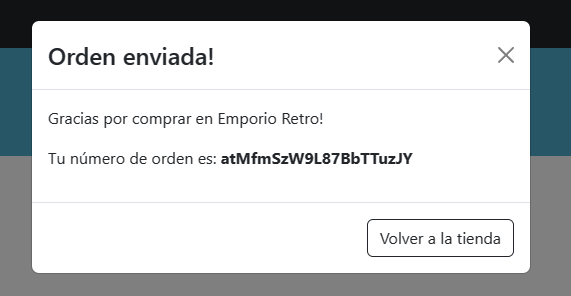
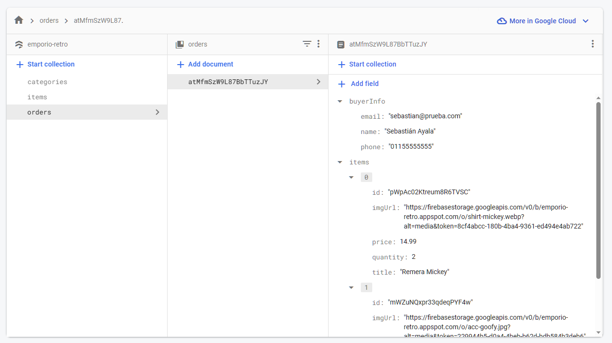

# Emporio Retro
## Proyecto Final del curso de React.js

Emporio Retro es un e-commerce construido utilizando las siguientes tecnologías:

* React.js
* Vite
* React-Bootstrap
* Firebase

## Funcionalidad

Las funcionalidades que ofrece el sitio son las siguientes:

### Listado de producto

Permite ver un listado de todos los productos disponibles.

### Listado de productos por categoría

Permite ver un listado de todos los productos dentro de la categoría seleccionada.

### Detalle de producto

Muestra más información acerca del producto seleccionado, y permite agregar el producto al carrito de compras. Una vez agregado, brinda la opción de ir al carrito o continuar comprando.

### Carrito de compras

Muestra todos los productos dentro del carrito de compras y permite realizar una compra, seguir viendo los productos disponibles, o vaciar el carrito.
Si el usuario selecciona "Realizar compra", se abre un modal en el cual se le solicita la información personal (nombre, teléfono y email).

Una vez ingresados los datos, se le brindará al usuario el ID de la compra, que equivale al ID autogenerado por Firebase al agregar el documento a la colección de órdenes de compra.

## Demo del sitio
